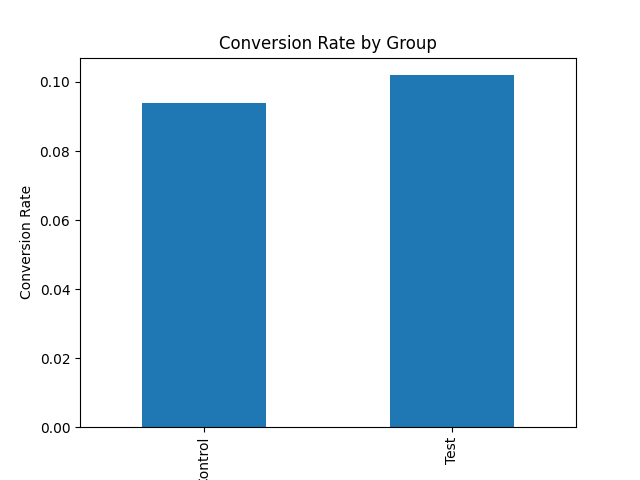

# A/B Testing Analysis: Website Conversion Experiment

## Project Overview

This project analyzes the results of an A/B test conducted to evaluate whether a new website design improves user conversion rates.

A/B testing is commonly used in product development at technology companies such as Google, Amazon, and Meta to make data-driven decisions about product changes.

The goal of this analysis is to determine whether the new design significantly increases the probability that a user converts.

---

## Dataset

The dataset simulates user interactions in an online experiment and contains the following variables:

| Column    | Description                                     |
| --------- | ----------------------------------------------- |
| group     | Experimental group assignment (Control or Test) |
| converted | Whether the user converted (1 = yes, 0 = no)    |

* **Control Group:** Users who saw the original website design
* **Test Group:** Users who saw the new website design

Total observations: **1000 users**

---

## Tools Used

* Python
* Pandas
* NumPy
* Matplotlib
* SciPy
* Google Colab

---

## Experiment Design

Two groups were compared:

| Group   | Description             |
| ------- | ----------------------- |
| Control | Original website design |
| Test    | New website design      |

The key metric analyzed was **conversion rate**, defined as the percentage of users who completed the desired action.

---

## Analysis Steps

1. Load and explore the dataset
2. Calculate conversion rates for each group
3. Visualize conversion differences
4. Conduct a statistical hypothesis test
5. Interpret the experiment results

---

## Visualization

### Conversion Rate by Group



---

## Hypothesis Testing

**Null Hypothesis (H₀):**
The new website design does not change the conversion rate.

**Alternative Hypothesis (H₁):**
The new website design improves the conversion rate.

A two-sample t-test was conducted to compare the conversion rates between the two groups.

**Result**

* p-value = **0.67**
* Significance level = **0.05**

Since the p-value is greater than the significance level, we **fail to reject the null hypothesis**.

---

## Key Findings

* The conversion rate difference between the control and test groups is small.
* Statistical testing shows the difference is **not statistically significant**.
* The observed variation is likely due to random chance rather than the new design.

---

## Business Recommendation

Based on the experiment results:

* The new design should **not be rolled out to all users yet**.
* Additional experiments should be conducted to test alternative design improvements.
* Future tests could also analyze conversion behavior across different user segments.

---

## Project Structure

```
ab-testing-analysis
│
├── notebook
│   └── ab_testing_analysis.ipynb
│
├── images
│   └── conversion_rate.png
│
└── README.md
```

---

## Author

Mia Duong
