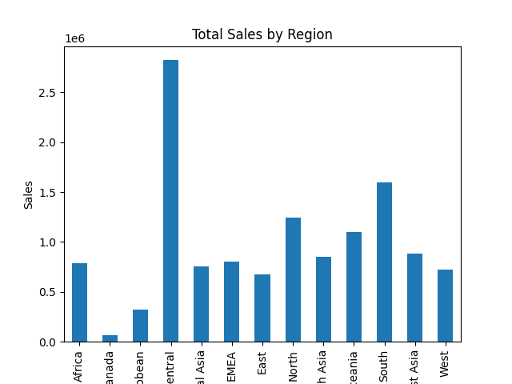
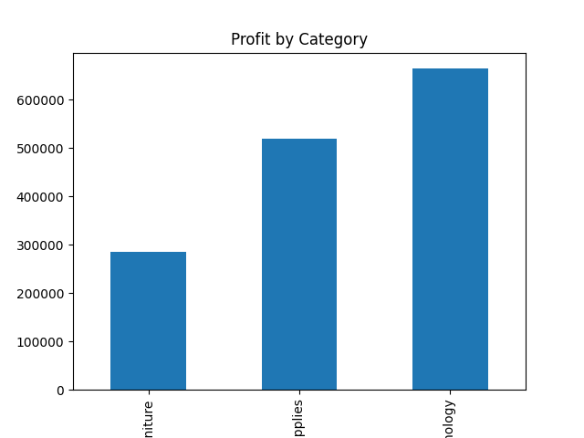
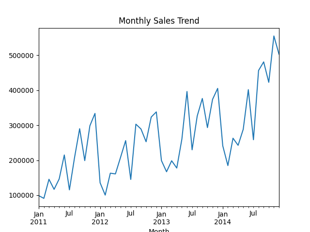
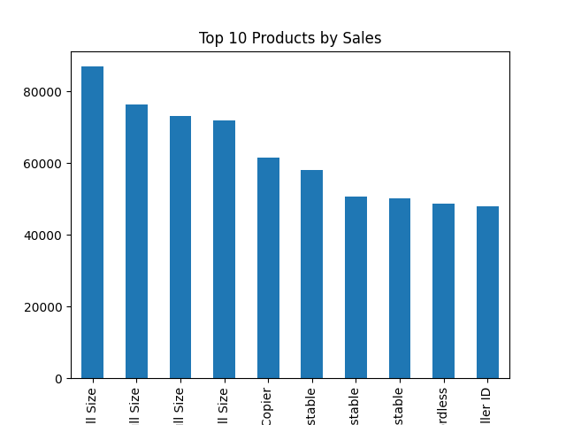

# Global Superstore Sales Analysis

## Project Overview

This project analyzes global retail sales data to identify trends in revenue, profitability, and product performance.

The objective is to generate business insights that can help a retail company improve decision-making related to product strategy, regional sales performance, and seasonal demand.

---

## Dataset

The dataset used in this project is the **Global Superstore dataset**, which contains transactional sales data from a global retail company.

Key fields include:

| Column        | Description                     |
| ------------- | ------------------------------- |
| Order Date    | Date of purchase                |
| Region        | Geographic sales region         |
| Category      | Product category                |
| Sub-Category  | Specific product type           |
| Product Name  | Name of the product             |
| Sales         | Revenue generated               |
| Profit        | Profit from the sale            |
| Customer Name | Customer purchasing the product |

---

## Tools Used

* Python
* Pandas
* Matplotlib
* Google Colab

---

## Project Objectives

The analysis focuses on answering several key business questions:

1. Which regions generate the highest revenue?
2. Which product categories are the most profitable?
3. How do sales trends change over time?
4. Which products contribute most to total revenue?

---

## Visualizations

### Sales by Region

### Profit by Category

### Monthly Sales Trend

### Top 10 Products by Sales

---

## Key Findings

* The **West region generates the highest total sales**.
* **Technology products produce the highest overall profit**.
* Sales show clear **seasonal patterns with increases during holiday periods**.
* A small number of products account for a large portion of total revenue.

---

## Business Recommendations

Based on the analysis:

* Increase marketing and inventory for high-performing products.
* Expand operations in high-revenue regions.
* Prepare inventory and logistics for seasonal demand spikes.
* Monitor low-profit product categories to improve margins.

---

## Project Structure

sales-dashboard-analysis
│
├── data
│   └── Global_Superstore.csv
│
├── notebook
│   └── sales_dashboard_analysis.ipynb
│
├── images
│   ├── sales_by_region.png
│   ├── profit_by_category.png
│   ├── monthly_sales.png
│   └── top_products.png
│
└── README.md

---

## Author

Mia Duong
